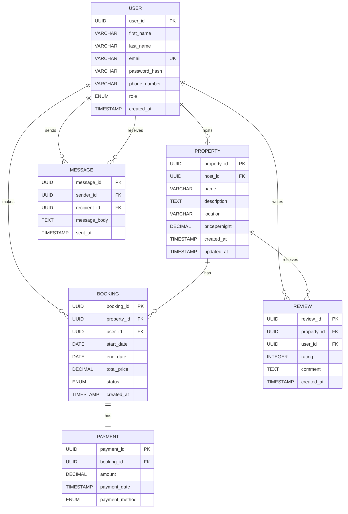

# Entity-Relationship Diagram - AirBnB Database

## Overview
This document describes the Entity-Relationship diagram for the AirBnB database system, including all entities, their attributes, and relationships.

---

## Entities and Attributes

### 1. User
**Primary Key:** `user_id` (UUID, Indexed)

**Attributes:**
- `user_id`: UUID, Primary Key, Indexed
- `first_name`: VARCHAR, NOT NULL
- `last_name`: VARCHAR, NOT NULL
- `email`: VARCHAR, UNIQUE, NOT NULL, Indexed
- `password_hash`: VARCHAR, NOT NULL
- `phone_number`: VARCHAR, NULL
- `role`: ENUM (guest, host, admin), NOT NULL
- `created_at`: TIMESTAMP, DEFAULT CURRENT_TIMESTAMP

**Constraints:**
- Unique constraint on `email`
- Non-null constraints on required fields

---

### 2. Property
**Primary Key:** `property_id` (UUID, Indexed)

**Attributes:**
- `property_id`: UUID, Primary Key, Indexed
- `host_id`: UUID, Foreign Key → User(user_id)
- `name`: VARCHAR, NOT NULL
- `description`: TEXT, NOT NULL
- `location`: VARCHAR, NOT NULL
- `pricepernight`: DECIMAL, NOT NULL
- `created_at`: TIMESTAMP, DEFAULT CURRENT_TIMESTAMP
- `updated_at`: TIMESTAMP, ON UPDATE CURRENT_TIMESTAMP

**Constraints:**
- Foreign key constraint on `host_id` references User(user_id)
- Non-null constraints on essential attributes

---

### 3. Booking
**Primary Key:** `booking_id` (UUID, Indexed)

**Attributes:**
- `booking_id`: UUID, Primary Key, Indexed
- `property_id`: UUID, Foreign Key → Property(property_id), Indexed
- `user_id`: UUID, Foreign Key → User(user_id)
- `start_date`: DATE, NOT NULL
- `end_date`: DATE, NOT NULL
- `total_price`: DECIMAL, NOT NULL
- `status`: ENUM (pending, confirmed, canceled), NOT NULL
- `created_at`: TIMESTAMP, DEFAULT CURRENT_TIMESTAMP

**Constraints:**
- Foreign key constraint on `property_id` references Property(property_id)
- Foreign key constraint on `user_id` references User(user_id)
- `status` must be one of: pending, confirmed, canceled

---

### 4. Payment
**Primary Key:** `payment_id` (UUID, Indexed)

**Attributes:**
- `payment_id`: UUID, Primary Key, Indexed
- `booking_id`: UUID, Foreign Key → Booking(booking_id), Indexed
- `amount`: DECIMAL, NOT NULL
- `payment_date`: TIMESTAMP, DEFAULT CURRENT_TIMESTAMP
- `payment_method`: ENUM (credit_card, paypal, stripe), NOT NULL

**Constraints:**
- Foreign key constraint on `booking_id` references Booking(booking_id)
- Ensures payment is linked to valid bookings

---

### 5. Review
**Primary Key:** `review_id` (UUID, Indexed)

**Attributes:**
- `review_id`: UUID, Primary Key, Indexed
- `property_id`: UUID, Foreign Key → Property(property_id)
- `user_id`: UUID, Foreign Key → User(user_id)
- `rating`: INTEGER, CHECK (rating >= 1 AND rating <= 5), NOT NULL
- `comment`: TEXT, NOT NULL
- `created_at`: TIMESTAMP, DEFAULT CURRENT_TIMESTAMP

**Constraints:**
- Foreign key constraint on `property_id` references Property(property_id)
- Foreign key constraint on `user_id` references User(user_id)
- Rating must be between 1 and 5 (inclusive)

---

### 6. Message
**Primary Key:** `message_id` (UUID, Indexed)

**Attributes:**
- `message_id`: UUID, Primary Key, Indexed
- `sender_id`: UUID, Foreign Key → User(user_id)
- `recipient_id`: UUID, Foreign Key → User(user_id)
- `message_body`: TEXT, NOT NULL
- `sent_at`: TIMESTAMP, DEFAULT CURRENT_TIMESTAMP

**Constraints:**
- Foreign key constraint on `sender_id` references User(user_id)
- Foreign key constraint on `recipient_id` references User(user_id)

---

## Relationships

### 1. User → Property (Host)
- **Type:** One-to-Many (1:N)
- **Description:** A User (as host) can own multiple Properties
- **Cardinality:** One User can have zero or many Properties
- **Foreign Key:** Property.host_id → User.user_id

### 2. User → Booking (Guest)
- **Type:** One-to-Many (1:N)
- **Description:** A User (as guest) can make multiple Bookings
- **Cardinality:** One User can have zero or many Bookings
- **Foreign Key:** Booking.user_id → User.user_id

### 3. Property → Booking
- **Type:** One-to-Many (1:N)
- **Description:** A Property can have multiple Bookings
- **Cardinality:** One Property can have zero or many Bookings
- **Foreign Key:** Booking.property_id → Property.property_id

### 4. Booking → Payment
- **Type:** One-to-One (1:1)
- **Description:** Each Booking has one Payment
- **Cardinality:** One Booking has exactly one Payment
- **Foreign Key:** Payment.booking_id → Booking.booking_id

### 5. Property → Review
- **Type:** One-to-Many (1:N)
- **Description:** A Property can have multiple Reviews
- **Cardinality:** One Property can have zero or many Reviews
- **Foreign Key:** Review.property_id → Property.property_id

### 6. User → Review (Reviewer)
- **Type:** One-to-Many (1:N)
- **Description:** A User can write multiple Reviews
- **Cardinality:** One User can have zero or many Reviews
- **Foreign Key:** Review.user_id → User.user_id

### 7. User → Message (Sender)
- **Type:** One-to-Many (1:N)
- **Description:** A User can send multiple Messages
- **Cardinality:** One User can send zero or many Messages
- **Foreign Key:** Message.sender_id → User.user_id

### 8. User → Message (Recipient)
- **Type:** One-to-Many (1:N)
- **Description:** A User can receive multiple Messages
- **Cardinality:** One User can receive zero or many Messages
- **Foreign Key:** Message.recipient_id → User.user_id

---

## ER Diagram (Mermaid Syntax)

---

## ER Diagram Representation

## Indexing Strategy

### Primary Keys (Automatically Indexed)
- User.user_id
- Property.property_id
- Booking.booking_id
- Payment.payment_id
- Review.review_id
- Message.message_id

### Additional Indexes
- **User Table:**
  - `email` (for unique constraint and fast lookups)

- **Property Table:**
  - `property_id` (included in foreign key references)

- **Booking Table:**
  - `property_id` (for efficient property-booking queries)
  - `booking_id` (for payment lookups)

- **Payment Table:**
  - `booking_id` (for efficient booking-payment queries)

---

## Relationship Summary Table

| Relationship | Type | Cardinality | Foreign Key |
|-------------|------|-------------|-------------|
| User → Property (Host) | One-to-Many | 1:N | Property.host_id → User.user_id |
| User → Booking (Guest) | One-to-Many | 1:N | Booking.user_id → User.user_id |
| Property → Booking | One-to-Many | 1:N | Booking.property_id → Property.property_id |
| Booking → Payment | One-to-One | 1:1 | Payment.booking_id → Booking.booking_id |
| Property → Review | One-to-Many | 1:N | Review.property_id → Property.property_id |
| User → Review (Reviewer) | One-to-Many | 1:N | Review.user_id → User.user_id |
| User → Message (Sender) | One-to-Many | 1:N | Message.sender_id → User.user_id |
| User → Message (Recipient) | One-to-Many | 1:N | Message.recipient_id → User.user_id |

---

## Key Observations

1. **Central Entity:** `User` is the central entity with multiple relationships to other entities
2. **Role-Based Relationships:** Users can act as hosts (Property), guests (Booking), reviewers (Review), and communicators (Message)
3. **Transactional Flow:** Booking → Payment represents the transaction flow
4. **Feedback Loop:** Property → Review provides feedback mechanism
5. **Communication:** Message enables user-to-user communication

---

## Notes

- All primary keys use UUID for globally unique identifiers
- Timestamps are used for audit trails (created_at, updated_at)
- ENUM types ensure data integrity for constrained values
- Foreign keys maintain referential integrity across tables
- Indexes are strategically placed for query optimization
